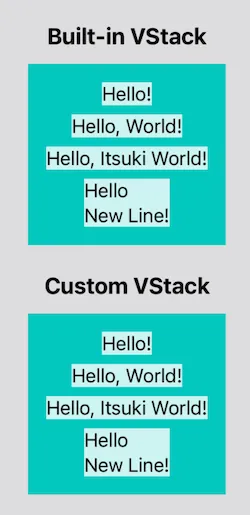
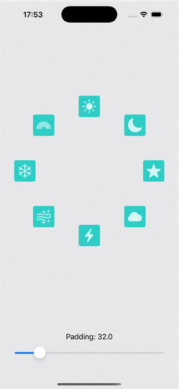
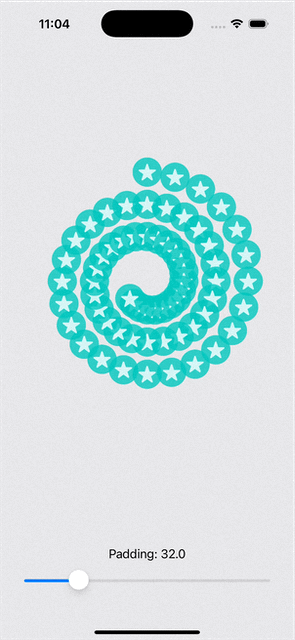

# Custom Layout in SwiftUI

## Basic
[`VStack` Copy cat](./CustomLayoutDemo/SimpleVStack.swift).

## Caching

### Cache as Storage
[Radial Stack](./CustomLayoutDemo/SimpleRadialStack.swift)

### Cache for Downstream Communication
[Spiral Stack](./CustomLayoutDemo/SpiralStack.swift)

## (Bi-direction) Custom Layout Values
[Pyramid Stack](./CustomLayoutDemo/PyramidStack.swift)

## Related Blogs
- [SwiftUI: Step 0 to Layout Protocol](https://levelup.gitconnected.com/swiftui-step-0-to-layout-protocol-40d274c48814)
- [SwiftUI: Caching in Layout Protocol]()
- [SwiftUI: Mastering Layout Values in Layout Protocol]()